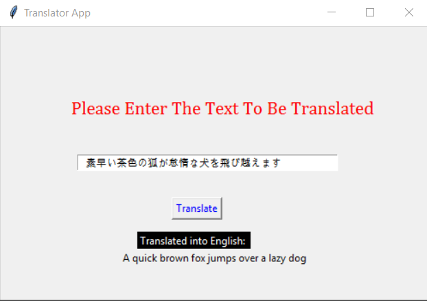

# Python-Translator-Desktop-App

This is a translator app that can take input from the user through a graphical user interface (GUI). It can automatically detect the language and then translate it into english. 
It then displys the translated text to the user. 

<h5> Tools Used </h5>
<ol>

<li> Tkinter </li>
<li> googletranslate library </li>

</ol>

